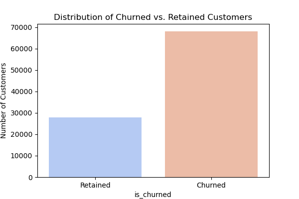
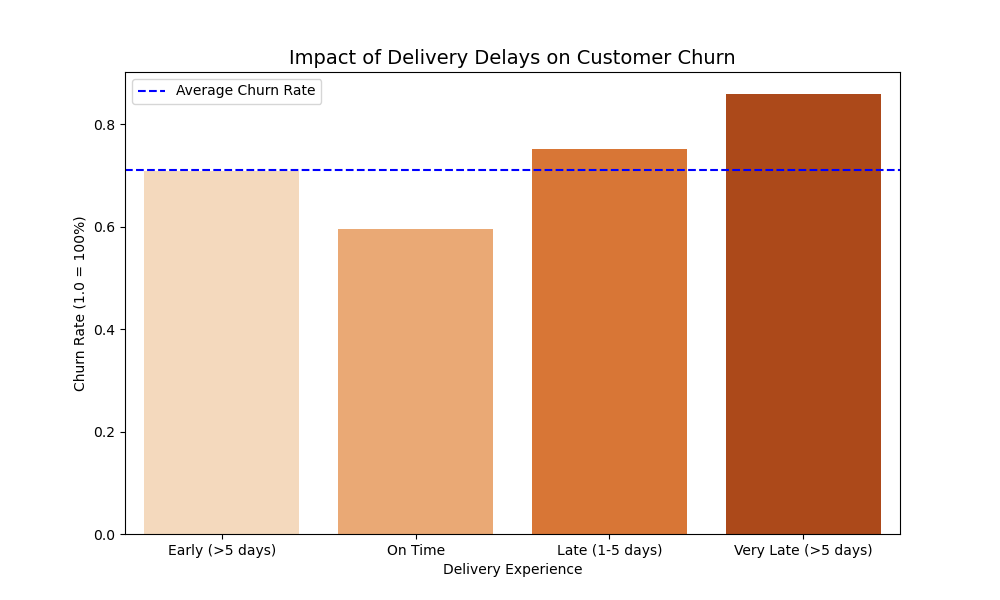
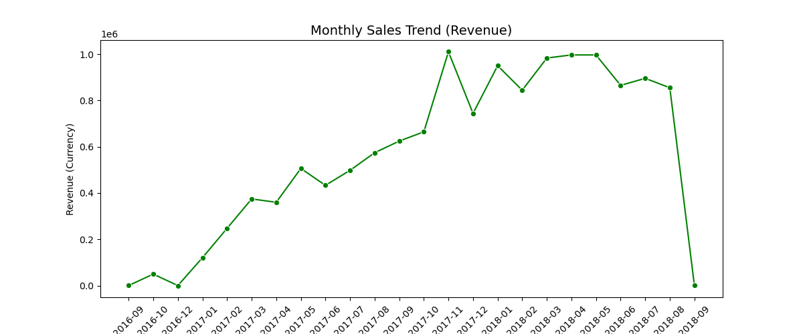

# Olist Customer Churn Analysis
This project analyzes customer behavior using the Brazilian E-Commerce Public Dataset by Olist to understand why customers stop buying (churn) and what factors drive customer dissatisfaction.
As an Analyst, the goal is to explore the data, identify churn patterns, evaluate delivery performance, and provide actionable business insights to improve customer retention and satisfaction.


#### This project focuses on:

► Exploratory Data Analysis (EDA)
► Churn Behavior Understanding
► Delivery Performance Impact
► Review Score Patterns
► Product Category Performance
► Revenue Trends
► Business Insights & Recommendations

## Dataset Components
The dataset is organized into multiple relational tables that cover different aspects of the e-commerce experience:

#### 1️. Orders & Order Status

    * Order creation time, approval, shipping, delivery timestamps
    * Whether the order was delivered, canceled, shipped, etc.

#### 2️. Payments & Installments

    * Payment method (credit card, boleto, voucher, etc.)

#### 3️. Delivery & Freight Performance

    * Estimated delivery date vs actual delivery
    * Delivery delays (Early, On-Time, Late, Very Late)
    * Freight value

#### 4️. Product Categories

    * Category of ordered products
    * Price and freight value per item

#### 5️. Customer Location

    * City, state, and zip prefix
    * Useful for geographic behavior analysis

#### 6️. Customer Reviews

    * Review score (1–5)
    * Review comments
    * Review creation date

#### 7️. Revenue Trends

    * Order value (price + freight)
    * Monthly and yearly revenue patterns

### Why This Dataset Works for Churn Analysis

1. It tracks multiple customer touchpoints (orders, delivery, payments, reviews).
2. Allows identification of behavior leading to churn, such as:

    * Delivery delays
    * Low review ratings
    * Low repeat purchase rate

3. Supports deep feature engineering, including:

    * Churn labels
    * Delivery performance categories
    * Customer lifetime revenue
    * Average review rating
    * Purchase frequency
## Project Folder Structure
```
olist-customer-churn-analysis/
│
├── data/
│   ├── raw/                 # Original Olist dataset files (CSV)
│   └── processed/           # Cleaned or merged datasets used for analysis
│
├── notebooks/
│   └── olist_churn_analysis.ipynb     # Main analysis notebook (EDA + Insights)
│
├── docs/
│   ├── About_Dataset.docx             # Dataset-level information
│   └── DS_Description.docx            # Table / column descriptions
│
├── images/
│   ├── churn_rate.png                 # Visuals used in README & PPT
│   ├── delivery_delay_vs_churn.png
│   ├── category_revenue.png
│   ├── review_score_distribution.png
│   └── revenue_trend.png
│
├── reports/
│   └── Customer Churn Prediction & Insights Analysis.pptx   # Final presentation
│
└── README.md                          # Main project documentation
```
## Analysis Workflow

This project combines Python and MySQL Workbench to perform data extraction, analysis, and insight generation.
All datasets were imported directly into MySQL, and SQL queries were executed from Python for analysis.

#### Database Integration (Python ↔ MySQL Workbench)
    
    * Established a connection between Python and MySQL Workbench using appropriate connectors.
    * Verified successful communication between both environments.
    * This integration allowed SQL queries to run directly from Python.
#### Dataset Import into MySQL
    
    * Imported all Olist datasets into Python (CSV files).
    * Used Python scripts to automatically upload these datasets into MySQL tables.
    * Renamed tables inside MySQL for better readability and analysis.
#### Master Analytics Table Creation (SQL)

✓ To perform customer-level churn analysis, a Master Analytics Table was created by joining multiple Olist datasets using SQL.

✓ This step combines Orders, Customers, Payments, Reviews, and Delivery data into a single consolidated table for deeper insights.

✓ All joining, metric calculations, and feature creation were done directly in MySQL, and SQL queries were executed through Python.

#### Key Features Created in the Master Table
1. Customer Interaction Metrics:
    * Total orders
    * First and last purchase dates
    * Customer activity window

2. Churn Flag: 
    * A customer is labeled as churned (1) if:
    * Last purchase date > 180 days (6 months) before final snapshot date

3. Delivery Performance: 
    * Delivery delay (Early, On-Time, Late, Very Late)

4. Financial Metrics: 
    * Order value
    * Freight value
    * Freight ratio (freight ÷ total cost)

5. Payment Behavior:
    * Used voucher (Yes/No)
    * Maximum installment count

6. Customer Experience Metrics:
    * Average review score
    * Average delivery delay
    * Average wait time

#### Purpose of Creating a Master Table

    * Analyze churn at customer level
    * Identify delivery-related churn drivers
    * Study revenue contribution
    * Measure customer satisfaction
    * Combine multiple signals into one analyst-ready dataset

## Key Insights

Below are the most important insights uncovered from the Olist e-commerce dataset after analyzing customer behavior, delivery performance, payments, reviews, and revenue trends.

1️. Overall Customer Churn Rate

    * Churned Customers: 71%
    * Retained Customers: 29%
    * Repeat Purchase Rate: only 3.12%

 ➤ Insight:
    * The business relies heavily on new customers, showing extremely low customer loyalty.

 ➤ Recommendation:
    * Introduce loyalty programs, retention offers, and personalized engagement.

Visualization:


2️. Delivery Performance Strongly Influences Churn

    * On-Time = 59%
    * Late (1–5 days delay) = 75%
    * Very Late (>5 days)	= 87%

➤ Insight:
    * Delivery delay is the #1 driver of churn.

➤ Recommendation:
    * Improve logistics SLAs, introduce delay alerts, offer apology coupons, and enable real-time tracking.

Visualization:


3️. Review Score Patterns

    * Average score: 4.08
    * Low ratings correlate with late deliveries
    * Experience metrics directly impact churn

➤ Insight:
    * Review scores act as a satisfaction indicator and support churn diagnosis.

➤ Recommendation:
    * Trigger follow-ups for low ratings, improve seller responsiveness.

4️. Product Category Performance

Top contributors:

    * Beauty & Health → highest orders
    * Watches & Gifts → highest per-unit revenue
    * Home & Bath, Sports, Electronics → stable performers

Low performers:
    * Automotive
    * Tools
    * Cool Stuff

➤ Insight:
    * Revenue is driven by a few strong categories; others underperform consistently.

➤ Recommendation:
    * Increase visibility for strong categories and bundle low performers.

Visualization:


5️. Revenue Trends Over Time

    * Revenue shows a strong upward trend from 2016–2018
    * Seasonal spikes (Nov 2017 – May 2018) show high demand patterns

➤ Insight:
    * Seasonality impacts sales significantly.

➤ Recommendation:
    * Increase inventory and marketing efforts during peak months.
    *Clear seasonal spikes, strong upward trend.

Visualization:


## Tools & Technologies Used

▪ Python
▪ MySQL Workbench
▪ SQL
▪ Pandas
▪ Matplotlib / Seaborn
▪ Jupyter Notebook

### Overall Insights

1. Churn Rate is High: 71% of customers did not return.

2. Delivery Delay Drives Churn: Late and very late deliveries have the highest churn rates.

3. Customer Satisfaction: Lower review scores are linked to delays and high freight charges.

4. Revenue Growth: Sales increased steadily from 2016–2018 with seasonal peaks.

5. Category Performance: Beauty & Health and Watches & Gifts generate the most revenue.

### Overall Suggestions

1. Improve delivery performance to reduce delays and increase customer satisfaction.

2. Introduce retention programs like loyalty points and next-order discounts.

3. Enhance customer communication during delays with real-time tracking updates.

4. Focus marketing on top-performing categories and optimize weaker ones.

5. Leverage seasonal peaks by increasing inventory and promotions during high-demand months.

## Conclusion

This analysis shows that customer churn at Olist is mainly driven by delivery delays, low satisfaction scores, and high freight costs. Although revenue is growing and certain categories perform strongly, the overall churn rate of 71% indicates a major retention challenge.

Improving delivery reliability, enhancing customer experience, and focusing on strong product categories can significantly reduce churn and help the business achieve long-term growth.